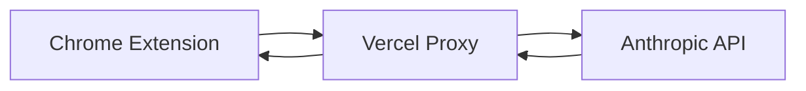

# Vercel Deployment Instructions

## Quick Setup (5 minutes)

### 1. Deploy to Vercel

Click this button to deploy instantly:

[](https://vercel.com/new/clone?repository-url=https://github.com/DougProceptra/TravianAssistant&env=ANTHROPIC_API_KEY&envDescription=Your%20Anthropic%20API%20key&project-name=travian-assistant-proxy)

OR manually:

1. Go to [vercel.com](https://vercel.com)
2. Click "Add New Project"
3. Import this repository
4. Add environment variable:
   - Name: `ANTHROPIC_API_KEY`
   - Value: Your Anthropic API key (sk-ant-...)
5. Click "Deploy"

### 2. Get Your Proxy URL

After deployment, Vercel will give you a URL like:
- `https://travian-assistant-proxy.vercel.app`

### 3. Configure Extension

1. Open the extension background console in Chrome
2. Set your proxy URL:

```javascript
chrome.storage.sync.set({ 
  proxyUrl: 'https://your-app-name.vercel.app/api/anthropic' 
}, () => console.log('Proxy configured!'));
```

### 4. Test It

In the extension background console:
```javascript
// Test the proxy
fetch('https://your-app-name.vercel.app/api/anthropic', {
  method: 'POST',
  headers: { 'Content-Type': 'application/json' },
  body: JSON.stringify({
    messages: [{ role: 'user', content: 'Say hello' }],
    max_tokens: 50
  })
}).then(r => r.json()).then(console.log);
```

## How It Works



- Extension sends requests to YOUR Vercel proxy
- Proxy adds YOUR API key (stored securely in Vercel)
- Proxy forwards to Anthropic and returns response
- No CORS issues, no API key in extension!

## Troubleshooting

### "Server configuration error"
- Your API key is not set in Vercel environment variables
- Go to Vercel Dashboard → Settings → Environment Variables
- Add `ANTHROPIC_API_KEY` with your key

### CORS errors still appearing
- Make sure you're using the proxy URL, not api.anthropic.com
- Check the URL includes `/api/anthropic` at the end

### "Invalid API key"
- Your Anthropic API key is invalid or expired
- Get a new key from [console.anthropic.com](https://console.anthropic.com)

## Local Development

To test locally before deploying:

```bash
# Install Vercel CLI
npm i -g vercel

# Run locally (in project root)
vercel dev

# Your local proxy will be at:
# http://localhost:3000/api/anthropic
```

## Security Notes

- Your API key is NEVER in the extension code
- API key is stored securely in Vercel environment variables
- Proxy can be enhanced with rate limiting if needed
- Consider adding authentication for production use
