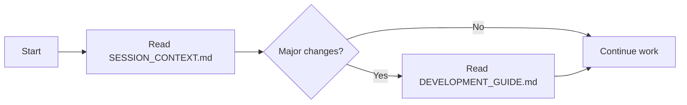

# TravianAssistant Documentation Index

## 📚 Documentation Overview

This directory contains all technical documentation for the TravianAssistant project. Start here to understand the system and find specific information.

## 🚀 Quick Navigation

### For New Sessions
1. **[SESSION_CONTEXT.md](./SESSION_CONTEXT.md)** - ⚠️ **START HERE EVERY SESSION**
   - Current project state
   - Active work items
   - Critical warnings and quirks
   - Next steps

### Development Guides
2. **[DEVELOPMENT_GUIDE.md](./DEVELOPMENT_GUIDE.md)** - How to develop
   - Build process (-fixed.ts files!)
   - Common pitfalls
   - Project structure
   - Testing procedures

### Implementation Documentation
3. **[PHASE1_IMPLEMENTATION_PLAN.md](./PHASE1_IMPLEMENTATION_PLAN.md)** - Complete Phase 1 blueprint
   - Architecture overview
   - API documentation
   - Deployment instructions
   - Cost analysis

4. **[OPTIMIZER_NOT_DEPLOYED.md](./OPTIMIZER_NOT_DEPLOYED.md)** - Game optimizer details
   - Algorithm documentation
   - Files created but not active
   - Integration requirements
   - Why it's not deployed yet

### Project Requirements
5. **[TRAVIAN_ASSISTANT_V3_COMPLETE.md](./TRAVIAN_ASSISTANT_V3_COMPLETE.md)** - Original requirements
   - Mission statement
   - Success metrics
   - Roadmap
   - Target capabilities

## 📋 Document Status

| Document | Purpose | Status | Last Updated |
|----------|---------|--------|--------------|
| SESSION_CONTEXT | Current state & next steps | 🟢 Active | Aug 28, 2025 |
| DEVELOPMENT_GUIDE | Dev process & pitfalls | 🟢 Active | Aug 28, 2025 |
| PHASE1_IMPLEMENTATION_PLAN | Technical blueprint | 🟡 Plan (not deployed) | Aug 28, 2025 |
| OPTIMIZER_NOT_DEPLOYED | Optimizer documentation | 🟡 Created, not active | Aug 28, 2025 |
| TRAVIAN_ASSISTANT_V3_COMPLETE | Requirements | 🟢 Reference | Aug 22, 2025 |

## 🔄 Document Workflow

### At Session Start:

### When Adding Features:
1. Check PHASE1_IMPLEMENTATION_PLAN for architecture
2. Follow DEVELOPMENT_GUIDE for process
3. Update SESSION_CONTEXT with changes
4. Document new discoveries

### When Debugging:
1. Check DEVELOPMENT_GUIDE "Common Pitfalls"
2. Review SESSION_CONTEXT "Critical Warnings"
3. Add new discoveries to guides

## 🎯 Current Priorities (Aug 28, 2025)

From SESSION_CONTEXT.md:
1. **Backend Connection** - Connect chat to port 3002
2. **Data Scraping** - Expand beyond village names
3. **Testing** - Verify data flow
4. **Then Optimizer** - Only after foundation works

## ⚠️ Critical Reminders

- **Always read SESSION_CONTEXT.md first**
- **Build uses `-fixed.ts` files, not regular `.ts`**
- **Optimizer is created but NOT deployed**
- **Backend connection needed before optimizer**

## 📝 Documentation Standards

### File Naming:
- UPPERCASE for important docs (SESSION_CONTEXT.md)
- snake_case for scripts (check-dev-status.js)
- kebab-case for web files (conversational-ai-fixed.ts)

### Update Frequency:
- SESSION_CONTEXT.md - Every session
- DEVELOPMENT_GUIDE.md - When discovering quirks
- Implementation docs - When architecture changes

### Markdown Conventions:
- Use emoji headers for visual scanning
- Include code examples
- Add "Last Updated" timestamps
- Use tables for structured data

## 🔍 Finding Information

### By Topic:
- **Current bugs/issues** → SESSION_CONTEXT.md
- **How to build** → DEVELOPMENT_GUIDE.md
- **Architecture** → PHASE1_IMPLEMENTATION_PLAN.md
- **Algorithms** → OPTIMIZER_NOT_DEPLOYED.md
- **Requirements** → TRAVIAN_ASSISTANT_V3_COMPLETE.md

### By Question:
- "What should I work on?" → SESSION_CONTEXT.md
- "Why isn't this working?" → DEVELOPMENT_GUIDE.md
- "How does the optimizer work?" → OPTIMIZER_NOT_DEPLOYED.md
- "What's the architecture?" → PHASE1_IMPLEMENTATION_PLAN.md

---

*This index is the entry point to all documentation. If you're lost, start here.*
